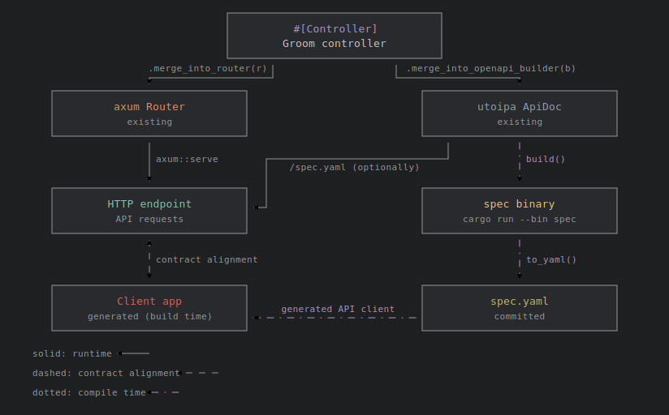

# Groom

❗ groom is WIP - **do not use in production!**

## Not a framework!

Groom is glue between user-defined controllers, an [axum](https://github.com/tokio-rs/axum) router, and [utoipa](https://github.com/juhaku/utoipa). Groom is not a framework. You write handler functions and data types in Rust; Groom wires them into axum routes and contributes paths and schemas to a utoipa `OpenApiBuilder`.

Groom is heavily inspired by [poem-openapi](https://github.com/poem-web/poem/blob/3bd9ee79e94b3f8a088a21e16648e7be6eed471c/poem-openapi-derive/src/api.rs).

See also: [quick-example](examples/quick-example) (the code below, as a buildable crate), [hello-world](examples/hello-world) (minimal app), [htmx](examples/htmx), and [todo](examples/todo) (full-stack example with spec generation and a TypeScript client).


## Quick example

```rust
use axum::Router;
use groom_macros::Controller;
use utoipa::{OpenApi, openapi::OpenApiBuilder};

#[Controller()]
mod api {
    use axum::{extract::Query, response::IntoResponse};
    use groom::{extract::GroomExtractor, response::Response};
    use groom_macros::{DTO, Response};

    #[Route(method = "get", path = "/hello")]
    pub async fn greet(Query(p): Query<GreetParams>) -> HelloResponse {
        let name = p.name.unwrap_or_else(|| "world".into());
        if name.is_empty() {
            HelloResponse::BadRequest(ErrorMessage {
                error: "`name` must be omitted or non-empty",
            })
        } else {
            HelloResponse::Hello(GreetMessage {
                message: format!("Hello, {name}!"),
            })
        }
    }

    #[DTO(parameters)]
    pub struct GreetParams {
        name: Option<String>,
    }

    #[Response(format(json))]
    pub enum HelloResponse {
        #[Response(code = 200)]
        Hello(GreetMessage),

        #[Response(code = 400)]
        BadRequest(ErrorMessage),
    }

    #[DTO(response)]
    pub struct GreetMessage {
        message: String,
    }

    #[DTO(response)]
    pub struct ErrorMessage {
        error: &'static str,
    }
}

fn make_router() -> Router {
    api::merge_into_router(Router::new())
}

fn make_openapi() -> utoipa::openapi::OpenApi {
    #[derive(OpenApi)]
    #[openapi(info(title = "My API", version = "0.1.0"))]
    struct ApiDoc;

    api::merge_into_openapi_builder(OpenApiBuilder::from(ApiDoc::openapi()))
        .build()
}
```

Return type of a handler function can also be a `Result<R, E>` with each side, R and E, being a `#[Response()]`.

Each `#[Controller]` module generates two functions:

- `merge_into_router` — registers Groom routes on an existing `Router`.
- `merge_into_openapi_builder` — merges paths and component schemas into an existing `OpenApiBuilder`.

Import `groom::extract::GroomExtractor` and `groom::response::Response` inside the controller module so extractors and response types can participate in OpenAPI generation.

## Problem being solved

Groom targets a statically-typed HTTP layer on top of axum and utoipa:

- Handler signatures describe request inputs and response outputs at compile time.
- Serialization and deserialization are handled by generated wrappers; handlers return domain types instead of manually building `Response` bodies.
- When a response type declares multiple formats (for example `json` and `html`), Groom performs automatic content negotiation from the client's `Accept` header and selects the matching serializer.
- OpenAPI is derived from the same types that drive routing, reducing drift between code and documentation.
- Groom supplements axum rather than wrapping the runtime: middleware, `Extension`, `State`, and non-Groom routes remain ordinary axum.
- The same handler can back a JSON API for programmatic clients and an HTML view for browsers — useful for status pages, admin dashboards, or embedding reports without maintaining separate endpoints.

Rust's algebraic type system (structs, enums, newtypes, `Option`, nested variants) is a strong foundation for modeling API data. A spec generated from well-structured Rust types is expected to produce a clearer contract than one maintained separately from implementation.

## Architecture of a Groom service

Groom does not own the HTTP server or the OpenAPI document. You start with infrastructure you already have — an axum `Router` (health checks, static files, middleware layers) and a utoipa `ApiDoc` (title, version, security schemes, tags). A `#[Controller]` module describes handlers and DTOs once; generated `merge_into_router` and `merge_into_openapi_builder` functions wire those definitions into both sides.



**Setup (compile time).** Handler signatures, request bodies, and response enums in the Groom controller are the single source of truth. `merge_into_router` registers Groom routes on the existing router without replacing it. `merge_into_openapi_builder` merges paths and component schemas into the existing `OpenApiBuilder` derived from your base `ApiDoc`.

**Runtime.** The merged router is served with `axum::serve`. HTTP clients call API endpoints directly. The merged OpenAPI document can optionally be exposed at runtime (for example `/spec.yaml` behind a flag, as in the [todo example](examples/todo/backend/src/controller/mod.rs)).

**Spec export (fork).** The same merged `OpenApi` value can also be made available offline: a simple companion `spec` binary calls `build()` / `to_yaml()` and prints the document. That output is committed as `spec.yaml` in the repository. Frontend tooling ([orval](https://orval.dev), other code generators) reads the committed file and produces a typed HTTP client at build time — without running the server.

The dashed line in the diagram marks contract alignment: the generated client and the live API share one spec, so breaking changes show up in `spec.yaml` diffs and compile-time checks on the backend.

The [todo example](examples/todo/backend) maps to this layout:

| Piece | Location |
|-------|----------|
| Groom controller | `controller/` |
| Business logic | `service/` |
| Persistence | `repository/` |
| Router + server | `bin/backend.rs` |
| Spec export binary | `bin/spec.rs` |
| Committed contract | `spec.yaml` (via `just generate-api-spec`) |

Multiple controllers compose by chaining `merge_into_router` and `merge_into_openapi_builder` (see `groom_tests/tests/features/multiple_controllers.rs`).

## Core components

Detailed architecture overviews are available for [groom](groom/ARCHITECTURE.md) and [groom_macros](groom_macros/ARCHITECTURE.md) crates.

### `#[Controller]`

Applied to a module containing route handlers and their supporting types.

| Option | Description |
|--------|-------------|
| `state_type = T` | Router state type (`S` in `Router<S>`). Defaults to `()`. When set, import `T` inside the module (required for macro expansion). |

Generated API:

- `merge_into_router(router: Router<S>) -> Router<S>`
- `merge_into_openapi_builder(builder: OpenApiBuilder) -> OpenApiBuilder`

Handlers annotated with `#[Route]` are wrapped to parse the `Accept` header and dispatch to `Response::__groom_into_response`. The original handler function remains a plain `async fn` returning a data structure.

### `#[Route]`

Marks a handler as an HTTP endpoint.

| Attribute | Description |
|-----------|-------------|
| `method` | HTTP method: `get`, `post`, `put`, `delete`, `patch`. |
| `path` | Route template with `{param}` placeholders (OpenAPI/axum style). |

Doc comments on the handler become OpenAPI `summary` and `description`.

Handler parameters use standard axum extractors (`Query`, `Path`, `Extension`, `State`, `HeaderMap`, `Request`, `String`, `Bytes`, …) plus Groom `RequestBody` types. Import `GroomExtractor` when using extractors that contribute to the OpenAPI operation.

### `#[DTO]`

Marks a struct or enum as a Data Transfer Object and generates `utoipa::ToSchema` plus serde derives as appropriate.

| Argument | Effect |
|----------|--------|
| `request` | `Deserialize`, `DTO_Request` |
| `response` | `Serialize`, `DTO_Response` |
| `parameters` | `Deserialize` (for query/path parameter structs) |

Combine arguments: `#[DTO(request, response)]`, `#[DTO(parameters)]`, etc. At least one argument is required.

Use `#[DTO(parameters)]` with `Query<T>` or `Path<T>`. Field doc comments and `serde` attributes (`rename`, `default`, …) are reflected in the schema.

Enums with variants (unit, tuple, struct) are supported as response DTOs; see `groom_tests/tests/features/value_objects.rs`.

#### Array query parameters

Axum's built-in `Query<T>` does not deserialize repeated query keys (for example `?status=New&status=Closed`) into `Vec` fields. For that, enable the optional `axum-extra-query` feature on `groom`, add `axum-extra` with its `query` feature, and use `axum_extra::extract::Query<T>` in the handler:

```toml
# Cargo.toml
groom = { version = "0.2", features = ["axum-extra-query"] }
axum-extra = { version = "0.12", features = ["query"] }
```

```rust
use axum_extra::extract::Query;

#[DTO(parameters)]
pub struct StatusFilter {
    status: Vec<Status>,
}

#[Route(method = "get", path = "/tasks")]
pub async fn list_tasks(Query(filters): Query<StatusFilter>) -> TaskListResponse {
    // GET /tasks?status=New&status=Closed
    todo!()
}
```

`Option<Vec<T>>` is supported as well: omitting the parameter yields `None`; repeating the key fills the vector. OpenAPI generation produces an `array` schema (or `array` + `null` for optional fields) with the same `#[DTO(parameters)]` struct. See `groom_tests/tests/features/request_query_params.rs` (`test_query_vec_of_enums`, `test_query_opt_vec_of_enums`).

### `#[RequestBody]`

Marks a struct as a request body extractor. Supports JSON and URL-encoded form data.

| Option | Description |
|--------|-------------|
| `format(json)` | Accept `application/json`. |
| `format(url_encoded)` | Accept `application/x-www-form-urlencoded`. |
| `format(json, url_encoded)` | Content negotiation on input (both formats). |

A named struct defines the body shape directly. A tuple struct wrapping a `#[DTO(request)]` type reuses the DTO schema:

```rust
#[DTO(request)]
pub struct Person { name: String, age: Option<u8> }

#[RequestBody(format(json, url_encoded))]
pub struct CreatePerson(Person);
```

Raw bodies: `String`, `Bytes`, or a type created with `groom::binary_request_body!`:

```rust
groom::binary_request_body!(ImageJpeg with content_type "image/jpeg");
```

### `#[Response]`

Describes how a handler return type maps to HTTP status codes and content types. Applied to an enum or struct.

**Enum (discriminated responses)** — each variant is a distinct HTTP response:

```rust
#[Response(format(json))]
pub enum TaskResponse {
    #[Response(code = 200)]
    Ok(TaskViewModel),

    #[Response(code = 404)]
    NotFound,

    #[Response(code = 500)]
    ServerError,
}
```

| Enum-level option | Description |
|-------------------|-------------|
| `format(json)` | JSON responses. |
| `format(plain_text)` | `text/plain; charset=utf-8`. |
| `format(html)` | `text/html; charset=utf-8`. |
| `format(json, html, plain_text)` | Multiple formats; client selects via `Accept`. |
| `default_format = "json"` | Format used when `Accept` is absent or unmatched. Required when multiple formats are declared. |

| Variant-level option | Description |
|----------------------|-------------|
| `code = N` | HTTP status code. Defaults to `200` when omitted on a variant inside a typed enum. |

Variant doc comments become response descriptions in OpenAPI.

**Struct (single response shape)** — one status code for the entire type:

```rust
#[Response(format(plain_text, html, json), default_format = "plain_text", code = 418)]
pub struct Health { pub is_alive: bool }
```

| Struct-level option | Description |
|---------------------|-------------|
| `code = N` | HTTP status code (default `200`). |
| `format(...)`, `default_format` | Same as for enums. |

JSON serialization uses serde. Plain-text responses use `From<T> for String` when defined.

**`Result` return type** — handlers can return `Result<Ok, Err>` instead of a response enum. The success type is a `#[Response]` struct (or enum variant); the error type is typically a `#[Response]` enum whose variants map to distinct HTTP status codes. Groom maps `Ok(...)` and `Err(...)` to the appropriate responses and documents all outcomes in OpenAPI.

```rust
#[Response(format(json), code = 200)]
pub struct GreetOk {
    message: String,
}

#[DTO(response)]
pub struct GreetError {
    error: &'static str,
}

#[Response(format(json))]
pub enum GreetFailure {
    #[Response(code = 400)]
    BadRequest(GreetError),
}

#[Route(method = "get", path = "/hello")]
pub async fn greet(Query(p): Query<GreetParams>) -> Result<GreetOk, GreetFailure> {
    let name = p.name.unwrap_or_else(|| "world".into());
    if name.is_empty() {
        return Err(GreetFailure::BadRequest(GreetError {
            error: "`name` must be omitted or non-empty",
        }));
    }
    Ok(GreetOk {
        message: format!("Hello, {name}!"),
    })
}
```

See `groom_tests/tests/features/response_type_result.rs` for a full example with multiple error status codes and OpenAPI assertions.

### HTML responses

HTML is a first-class response format alongside JSON and plain text. Typical use cases:

- **HTMX applications** - with easy to set up well-typed controllers.
- **Human-readable status or health pages** — operators hit `/status` in a browser while monitoring tools call the same route with `Accept: application/json`.
- **Lightweight admin or debug UIs** — expose a read-only view of internal state without a separate frontend build.
- **Mixed clients on one contract** — declare `format(json, html)` on a response type so API consumers and browsers share handlers and OpenAPI paths.

**HTML-only endpoint** — return a `String` or a `#[DTO(response)]` struct with `format(html)`:

```rust
#[Response(format(html))]
pub enum StatusPageResponse {
    #[Response(code = 200)]
    Ok(StatusView),
}
```

**Rendering a struct as HTML** — implement `groom::html_format!` for types used in HTML (or multi-format) responses:

```rust
groom::html_format!(StatusView, self {
    format!("<p>status: <b>{}</b></p>", self.status)
});
```

The macro body is the right place to call a templating engine. For anything beyond trivial markup, prefer a crate such as [Askama](https://github.com/djc/askama), [Tera](https://github.com/Keats/tera), or [Minijinja](https://github.com/mitsuhiko/minijinja) over ad-hoc `format!` strings — templates separate layout from data, support inheritance/partials, and handle escaping consistently. A handler still returns your domain type; `html_format!` renders the template:

```rust
groom::html_format!(StatusView, self {
    // Pseudocode: render a template with `self` as context
    status_template.render(self).unwrap()
});
```

When building HTML manually, escape any user-controlled values to avoid XSS (see `groom_tests/tests/features/response_type_html.rs`).

**Content negotiation with HTML** — combine formats and set a default when `Accept` is missing or unmatched:

```rust
#[Response(format(json, html), default_format = "json")]
pub enum StatusResponse {
    #[Response(code = 200)]
    Ok(StatusView),
}
```

See `groom_tests/tests/features/response_content_negotiation.rs` for full `Accept` header behavior.

### Supporting traits and macros

| Item | Role |
|------|------|
| `groom::extract::GroomExtractor` | Extends axum extractors with OpenAPI metadata. |
| `groom::response::Response` | Converts return types to HTTP responses and OpenAPI response definitions. |
| `groom::binary_request_body!` | Newtype over `Bytes` with a custom request content type. |
| `groom::html_format!` | Defines HTML rendering for a type used in multi-format responses. |
| `utoipa::ToSchema` / `utoipa::PartialSchema` | Required on nested types referenced inside DTOs and responses. |

## Integrating with an existing router and OpenAPI spec

Groom is designed to merge into infrastructure you already have.

**Router** — start from any `Router` (or `Router<S>` with state), add non-Groom routes first or interleave via multiple merge calls:

```rust
let router = Router::new()
    .route("/health", get(health_check));

let router = todos::merge_into_router(router);
let router = router.layer(Extension(app.task_service));
```

**OpenAPI** — start from a utoipa `#[derive(OpenApi)]` struct for API metadata (title, version, contact, security schemes, tags), then merge controller paths:

```rust
#[derive(OpenApi)]
#[openapi(
    info(title = "TODO example", version = "0.0.1"),
    // tags, servers, security, …
)]
struct ApiDoc;

let spec = todos::merge_into_openapi_builder(OpenApiBuilder::from(ApiDoc::openapi()))
    .build();
```

The base `ApiDoc` and Groom controllers share one spec: Groom adds `paths` and `components.schemas`; utoipa retains global metadata. Multiple controllers chain `merge_into_openapi_builder` the same way as routers.

See how the [hello-world](examples/hello-world/src/main.rs) example serves the merged YAML at `/spec.yaml` via an axum `Extension`, and [todo example](examples/todo/backend/src/controller/mod.rs) gates this behind a `--serve-spec` flag.

## Companion spec binary

Place a small binary next to the main server crate to export OpenAPI without starting HTTP. The [todo example](examples/todo/backend/src/bin/spec.rs) writes the same spec the server would use:

```rust
// src/bin/spec.rs
use groom_example_todo_backend::controller::make_spec;

fn main() -> color_eyre::eyre::Result<()> {
    color_eyre::install()?;
    print!("{}", make_spec()?.get());
    Ok(())
}
```

`make_spec` lives in the library crate and shares the merge logic with the server:

```rust
pub fn make_spec() -> Result<Spec> {
    #[derive(OpenApi)]
    #[openapi(info(title = "TODO example", version = "0.0.1"))]
    struct ApiDoc;

    let builder = OpenApiBuilder::from(ApiDoc::openapi());
    Ok(Spec(todos::setup_spec(builder).build().to_yaml()?))
}
```

Build and run:

```sh
cargo run --bin spec > spec.yaml
```

See how the [justfile of todo example](examples/todo/justfile) defines `generate-api-spec` and chains it before `generate-api-client` (`npm run generate:api` / `orval` against `spec.yaml`, configured in [orval.config.ts](examples/todo/frontend/orval.config.ts)).

### Suggested contract-first workflow

1. **Define stubs** — Backend and frontend agree on controller modules with handler signatures, DTOs, and response enums. Implement handlers with `todo!()` or minimal placeholders.
2. **Generate spec** — Run the spec binary; commit `spec.yaml` (or JSON) to the repository.
3. **Review** — Both teams review the generated OpenAPI document. Adjust Rust types (field names, variants, status codes, doc comments) until the contract is acceptable. Regenerate until approved.
4. **Parallel implementation** — Frontend generates a client from the committed spec (e.g. [orval](https://orval.dev) as in [todo/frontend](examples/todo/frontend)). Backend fills in service and repository logic. Types on both sides stay aligned with the same source of truth.
5. **CI** — Add a check that `cargo run --bin spec` output matches the committed file, so API changes are explicit in diffs.

Because the spec is derived from Rust types, refactors that break the contract fail at compile time on the backend; the committed spec diff signals breaking changes to the frontend.

## Examples

| Example | Path | Purpose |
|---------|------|---------|
| Quick example | [examples/quick-example](examples/quick-example) | JSON greet endpoint from this guide; snippet kept in sync with `QUICKSTART.md`. |
| Hello world | [examples/hello-world](examples/hello-world) | Single controller, plain-text responses, inline spec route. |
| HTMX app | [examples/htmx](examples/htmx) | Simple backend with HTMX, rendered with minijinja templating engine. |
| Todo app | [examples/todo](examples/todo) | Layered backend, multiple endpoints, spec binary, Vue frontend with generated client. |

Run the todo backend (with spec endpoint and CORS for local frontend):

```sh
cd examples/todo && just run-backend
```

## Feature tests as reference

The [groom_tests](groom_tests/tests/features/) crate exercises individual features in isolation. Useful entry points:

| Test module | Topic |
|-------------|-------|
| `request_body` | `RequestBody`, raw bodies, `binary_request_body!` |
| `request_query_params` | `#[DTO(parameters)]` with `Query`; `Vec` / `Option<Vec>` via `axum_extra::extract::Query` |
| `request_path_params` | Path parameters and enums in paths |
| `request_headers` | `HeaderMap` extractor |
| `request_methods` | All HTTP methods on one path |
| `request_axum_request_extractor` | Full `Request` extractor |
| `response_type_json` / `response_type_plaintext` / `response_type_html` | Single-format responses |
| `response_type_result` | `Result<Ok, Err>` handler return types |
| `response_struct` | Struct (non-enum) responses, `html_format!` |
| `response_content_negotiation` | Multi-format responses and `Accept` |
| `value_objects` | Algebraic types in response schemas |
| `dependency_injection` | `Extension` and `State` |
| `multiple_controllers` | Composing routers and OpenAPI builders |


## Further work

[List of things to do](TODO.md).


## Licensing:

[MIT](LICENSE-MIT) or [Apache 2.0](LICENSE-APACHE).
