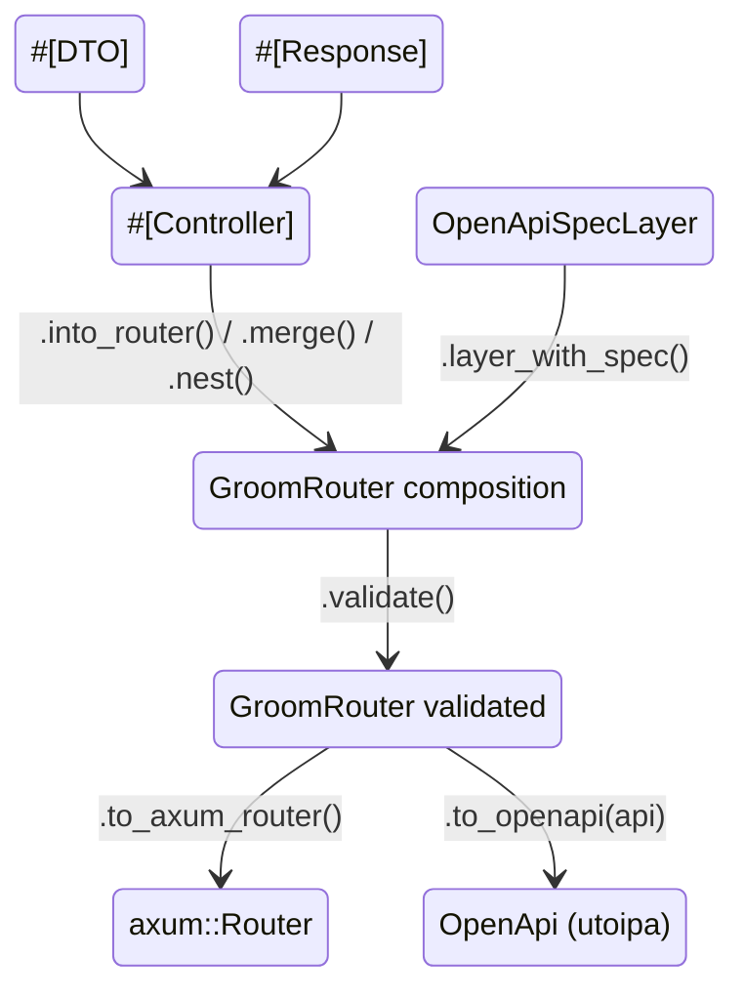

# Groom architecture

The diagram below shows how user annotations and middleware produce a runnable axum service and a matching OpenAPI document. The [GroomRouter lifecycle](#groomrouter) section details the composition steps.



## groom (runtime crate)

The `groom` crate is the **runtime library** for [Groom](https://github.com/root-talis/groom). It provides traits, content negotiation, OpenAPI component bookkeeping, and small helper macros. Compile-time code generation (proc-macros, handler wrappers, route registration) lives in the sibling `groom_macros` crate. This document covers both, with the codegen side in [groom_macros (codegen)](#groom_macros-codegen).

Groom sits between user-defined controller modules and two existing ecosystems:

- **[axum](https://github.com/tokio-rs/axum)** — routing, extractors, `IntoResponse`
- **[utoipa](https://github.com/juhaku/utoipa)** — OpenAPI document construction

Handlers return domain types. Generated wrappers call into this crate to turn those types into HTTP responses and to enrich OpenAPI operations.

### Crate layout

```
groom/groom/src/
├── lib.rs                  # Public modules, DTO marker traits
├── content_negotiation.rs  # Accept / Content-Type parsing
├── json_ptr.rs             # JSON Pointer escaping for $ref paths
├── runtime_checks.rs       # HTTP status code collision detection
├── extract/
│   ├── mod.rs              # GroomExtractor trait, binary_request_body!, groom_empty_extractor!
│   ├── components_registry.rs
│   ├── parameters.rs       # Path<T> / Query<T> OpenAPI wiring (+ axum-extra Query)
│   └── std_types.rs        # Built-in axum extractors
├── response/
│   ├── mod.rs              # Response trait
│   ├── html_response.rs    # HtmlFormat trait, html_format!
│   └── result.rs           # Result<T, E> as Response
└── router/
    ├── mod.rs              # Module exports, prepend_path, with_state, NotValidated/Validated
    ├── core.rs             # GroomRouter struct: new, merge, nest, layer, layer_with_spec
    ├── traits.rs           # OpenApiSpecLayer, SpecLayerModifier
    ├── openapi.rs          # to_openapi, to_axum_router
    ├── validate.rs         # validate() route-shadow detection
    └── error.rs            # MergeError, RouterValidationError
```

### GroomRouter

`GroomRouter` is the central composition type. It carries both the axum routing tree and the accumulated OpenAPI metadata.

**Typestate.** `GroomRouter<S = (), V = NotValidated>` — the second type parameter tracks validation state, where `V ∈ {NotValidated, Validated}`. `GroomRouterValid<S = ()>` is the alias for `GroomRouter<S, Validated>`. Terminal operations (`to_axum_router`, `to_openapi`) exist only on `GroomRouter<S, Validated>`. It is a compile error to convert to a final artifact before `.validate()`.

**Construction.** `GroomRouter::new()` creates an empty router with no routes, no paths, and an empty `ComponentsRegistry`. It is useful as an identity value when you start composition:

```rust
let api = GroomRouter::new()
    .merge(controller_a::into_router())?
    .nest("/api/v1", controller_b::into_router())?
    .validate()?;
```

`controller::into_router()`, generated by `#[Controller]`, is the normal entry point. `from_controller_parts(...)` is `#[doc(hidden)]` macro plumbing. It bridges generated code and the router; it is not user API.

**`merge(self, other) -> MergeResult<Self>`.** Combines two routers at the same path level:

- Axum router trees are merged via `axum::Router::merge()`.
- OpenAPI path entries are concatenated (no prefix transformation).
- `ComponentsRegistry` entries are merged. If the same schema name maps to different types across the two controllers, `MergeError::SchemaConflict` is returned. Identical schemas with the same name are accepted and deduplicated.

**`nest(self, path, other) -> MergeResult<Self>`.** Mounts `other` under a path prefix:

- Axum router is nested via `axum::Router::nest()`.
- OpenAPI path entries from `other` are prefixed using `prepend_path(prefix, path)`.
- The same schema-conflict detection applies as in `merge()`.

Both return `MergeResult<Self>`, a `Result` alias with `MergeError` as the error type. This is the primary mechanism for detecting schema name collisions between independently developed controllers.

**Layer delegation.** These methods delegate transparently to the inner `axum::Router` and return `Self`:

```rust
pub fn layer<L>(self, layer: L) -> Self;
pub fn route_layer<L>(self, layer: L) -> Self;
pub fn fallback<H, T>(self, handler: H) -> Self;
```

`with_state(state)` is available on `GroomRouter<(), NotValidated>` and transitions to `GroomRouter<S2, NotValidated>`.

**`layer_with_spec<SL>(self, spec_layer: SL) -> Self where SL: OpenApiSpecLayer + Clone`.** Takes a **single** argument (the spec layer). It mounts the layer on the request pipeline via `SL::mount(self.router)` **and** stores a type-erased clone for spec contribution during `to_openapi()`. See [OpenApiSpecLayer](#openapispeclayer).

**`validate(self) -> Result<GroomRouter<S, Validated>, RouterValidationError>`.** Transitions the router from `NotValidated` to `Validated`. During validation, all accumulated OpenAPI path entries are checked for **route shadowing**: the same HTTP method on the same path registered by more than one controller. On collision, it returns `RouterValidationError::RouteShadow { path, method }`.

This catch matters because axum allows overlapping routes (the last registration wins). Two handlers for the same `(method, path)` across different controllers are almost certainly a programming error.

**Terminal operations** (only on `GroomRouter<S, Validated>`, enforced at compile time by the typestate pattern):

- `to_openapi(&self, api: OpenApi) -> OpenApi` — borrows the validated router and merges its accumulated OpenAPI paths and components into an existing `OpenApi` document. The caller provides the base `OpenApi` value (typically carrying `info`, `servers`, `tags`, and top-level components):

  ```rust
  let spec = router.to_openapi(ApiDoc::openapi());
  ```

- `to_axum_router(self) -> axum::Router<S>` — consumes the `GroomRouter` and returns the inner `axum::Router<S>`. It is ready to be merged into the application's top-level router or served directly:

  ```rust
  let app = my_controller::into_router()
      .validate()?
      .to_axum_router();
  ```

**Error types** (defined in `router/error.rs`, `thiserror`-based):

```rust
pub enum MergeError {
    SchemaConflict { name: String, source_a: String, source_b: String },
    SchemaNotFound { path: String, registry: String },
}

pub enum RouterValidationError {
    RouteShadow { path: String, method: http::Method },
}
```

- `MergeError::SchemaConflict` — two controllers define different Rust types with the same OpenAPI schema name.
- `MergeError::SchemaNotFound` — a `$ref` points to a schema that was not registered.
- `RouterValidationError::RouteShadow` — the same `(path, method)` pair appears in more than one controller after composition.

**Path prefix helper.** `prepend_path(prefix: &str, path: &str) -> String` prepends a path prefix for OpenAPI path entries under `.nest()`. It mirrors axum's internal `path_for_nested_route` logic. Both `prefix` and `path` must start with `/`.

### OpenApiSpecLayer

`OpenApiSpecLayer` is the extension point for tower middleware to contribute to the generated OpenAPI spec. It lives in `groom/groom/src/router/traits.rs`:

```rust
pub trait OpenApiSpecLayer: Send + Sync + Clone + 'static {
    fn modify_openapi(&self, _api: &mut utoipa::openapi::OpenApi) { /* default: no-op */ }
    fn modify_operation(&self, _path: &str, _method: &utoipa::openapi::path::HttpMethod,
                        _operation: &mut utoipa::openapi::path::Operation) { /* default: no-op */ }
    fn clone_box(&self) -> Box<dyn SpecLayerModifier> { Box::new(self.clone()) }
    fn mount<S>(&self, r: axum::Router<S>) -> axum::Router<S> where S: Clone + Send + Sync + 'static; // REQUIRED
}
```

The four methods:

- `modify_openapi(&self, api: &mut OpenApi)` — whole-spec modification (security schemes, response codes, info metadata). Default no-op; called once per unique spec layer during `to_openapi()`.
- `modify_operation(&self, path: &str, method: &HttpMethod, operation: &mut Operation)` — per-`(path, method)` modification (e.g. adding `security` requirements to each operation). Default no-op; called before `modify_openapi`.
- `clone_box(&self) -> Box<dyn SpecLayerModifier>` — type-erased cloning so `GroomRouter` can store spec layers and remain `Clone`. Default delegates to the type's `Clone` impl.
- `mount<S>(&self, r: axum::Router<S>) -> axum::Router<S>` — **REQUIRED**. This hook mounts the layer into the axum request pipeline. `layer_with_spec()` calls it on the router side.

**Internal storage trait.** `SpecLayerModifier: Send + Sync + 'static` mirrors `OpenApiSpecLayer`'s `modify_openapi`, `modify_operation`, and `clone_box`, but omits the generic `mount<S>` method. A blanket impl delegates from `OpenApiSpecLayer` to `SpecLayerModifier`. The trait exists because `mount<S>` is generic over `S`. A trait object `Box<dyn OpenApiSpecLayer>` would need the state type spelled out. The storage trait avoids that by leaving `mount` out entirely.

**Per-path storage.** `GroomRouter` holds `path_spec_layers: HashMap<String, Vec<Box<dyn SpecLayerModifier>>>`, keyed by path string. `layer_with_spec()` pushes a clone of the layer into **every existing path's** layer list. On an empty router, no paths exist yet, so it records nothing until `from_controller_parts` seeds the map.

**Merge vs nest semantics.** `merge()` concatenates the `path_spec_layers` maps. Each router's layers stay keyed under its own paths. `nest(path, other)` re-keys `other`'s layers under `prepend_path(path, p)`. A spec layer attached to `/inner` inside a router nested at `/api` ends up keyed at `/api/inner`. Layers are therefore **isolated per path**: composing routers never spreads one controller's spec layers onto another controller's paths.

**Invocation order in `to_openapi()`.** For each `(path, method)` pair with an `Operation`, the stored layers for that path call `modify_operation` first. Then `modify_openapi` is called once per **unique** spec layer across all paths. A `HashSet<*const dyn SpecLayerModifier>` deduplicates by pointer identity, so a layer stored on several paths still gets one whole-spec pass.

**Design intent.** A spec layer only affects the paths it was attached to. `modify_operation` runs only for paths in that layer's key list. The whole-spec `modify_openapi` is deduplicated, so identical layers do not run twice. This keeps middleware-driven spec contributions (auth, rate limiting) scoped to the routes they actually wrap.

### Core traits

Marker traits indicate how a type is used in the API contract. Only `#[DTO(...)]` implements them (generated in `groom_macros`). Do not implement them manually.

| Trait | Meaning |
|-------|---------|
| `DTO` | Type is annotated with `#[DTO(...)]`; requires `utoipa::ToSchema` |
| `DTO_Request` | `#[DTO(request)]` — used as request body schema |
| `DTO_Response` | `#[DTO(response)]` — used as response body schema |

`DTO` + `utoipa::IntoParams` is required for path and query parameter structs (`#[DTO(parameters)]`).

### Extraction

#### `GroomExtractor`

```rust
pub trait GroomExtractor {
    fn __openapi_modify_operation(
        op: OperationBuilder,
        components: &mut ComponentsRegistry,
    ) -> OperationBuilder;
}
```

Any handler argument that should appear in the OpenAPI operation must implement this trait, in addition to axum's `FromRequest` where applicable. The macro crate asserts `GroomExtractor` at compile time for every handler parameter.

Implementations in this crate:

| Type | OpenAPI effect |
|------|----------------|
| `Query<T>` where `T: DTO + IntoParams` | Query parameters from `T::into_params` |
| `axum_extra::extract::Query<T>` where `T: DTO + IntoParams` | Same as `Query<T>`; requires feature `axum-extra-query` (repeated keys → `Vec` fields) |
| `Path<T>` where `T: DTO + IntoParams` | Path parameters from `T::into_params` |
| `String` | Request body `text/plain` |
| `Bytes` | Request body `application/octet-stream` (binary) |
| `Request`, `HeaderMap`, `Extension<T>`, `State<T>` | No OpenAPI change (pass-through) |

`#[RequestBody]` types implement `GroomExtractor` in `groom_macros`. Use `groom::binary_request_body!` for custom binary content types over `Bytes`.

#### `groom_empty_extractor!`

Exported macro for third-party or custom axum extractors that should not alter the OpenAPI document:

```rust
groom::groom_empty_extractor!(MyCustomExtractor);
```

#### `ComponentsRegistry`

When building OpenAPI, nested DTO schemas must be registered under `#/components/schemas/...` with stable `$ref` pointers. `ComponentsRegistry`:

1. Calls `ToSchema::schemas` to collect nested schema names.
2. Registers each named schema once, building a `Ref` with a JSON-Pointer-safe path via `json_ptr::escape_json_pointer`.
3. Skips inline registration for primitive-like schemas (currently `String`).
4. Panics on name collisions between different Rust types that share the same schema name within a single controller.
5. Merges into an existing `utoipa::openapi::Components` via `into_components`, detecting duplicate definitions across controllers.

At the `GroomRouter` level, `ComponentsRegistry::merge()` catches schema conflicts between controllers and surfaces them as `MergeError::SchemaConflict` from `.merge()` and `.nest()`.

`parameters.rs` uses the registry when wiring `Path<T>` and `Query<T>`. Parameter schemas are matched to registered components, so operations reference `$ref` instead of duplicating inline schemas.

Axum's `Query` cannot deserialize repeated query keys into `Vec` fields. The optional Cargo feature `axum-extra-query` adds a `GroomExtractor` impl for `axum_extra::extract::Query<T>` with identical OpenAPI folding. Handlers that need `Vec` or `Option<Vec>` in a `#[DTO(parameters)]` struct should use that extractor and depend on `axum-extra` with the `query` feature.

### Responses

#### `Response`

```rust
pub trait Response {
    fn __openapi_modify_operation(op: OperationBuilder, c: &mut ComponentsRegistry) -> OperationBuilder;
    fn __groom_negotiate_content_type(accept: &Accept) -> Result<Option<Mime>, axum::response::Response>;
    fn __groom_into_response(self, negotiated: Option<&mime::Mime>) -> axum::response::Response;
    fn __groom_check_response_codes(context: &str, codes: &mut HTTPCodeSet);
}
```

Implemented by `#[Response]` enums and structs in `groom_macros`. Responsibilities split as follows:

| Method | When | Role |
|--------|------|------|
| `__openapi_modify_operation` | Spec generation | Adds response entries (status, content types, schemas) |
| `__groom_negotiate_content_type` | Each request, before the handler runs | Negotiation (once, in the generated wrapper) |
| `__groom_into_response` | Each request | Serialization using the pre-negotiated mime |
| `__groom_check_response_codes` | `into_router()` (once) | Ensures distinct status codes across variants |

#### `Result<T, E>`

`response/result.rs` provides a blanket impl when both `T` and `E` implement `Response`:

- OpenAPI merges success and error response definitions.
- `Ok(v)` and `Err(e)` delegate to the respective `__groom_into_response`.
- Status-code checks run on both sides with distinct context strings.

This allows handlers to return `Result<GreetOk, GreetFailure>` instead of a single response enum.

#### HTML (`html_response.rs`)

For `format(html)` or multi-format responses, body types must implement `HtmlFormat`:

```rust
pub trait HtmlFormat {
    fn render(self) -> Html<Body>;
}
```

`String` and `&'static str` implement `HtmlFormat` directly. For domain types, use `groom::html_format!` to plug in templating (Askama, Tera, Minijinja, or plain `format!`).

Generated code (`groom_macros`) handles JSON and plain-text serialization. HTML goes through `HtmlFormat::render`.

### Content negotiation

#### Outgoing responses (`Accept`)

`parse_accept_header` reads `HeaderMap` and parses `Accept` into `accept_header::Accept`. Negotiation runs **once per request, in the generated wrapper before the handler executes** — never inside response conversion. `__groom_negotiate_content_type` compares the client's preferences against the return type's `const` list of supported MIME types, from `#[Response(format(...))]`:

- `Accept` absent → negotiation returns `Ok(None)` and `default_format` from the `#[Response]` attribute is used (required when multiple formats are enabled).
- `Accept` present and matching a supported format → the negotiated mime is passed to `__groom_into_response`, which serializes to that type.
- `Accept` present but matching none of the supported types → the wrapper returns `406 Not Acceptable` with a `Vary: Accept` header and a `text/plain` body listing the supported types (`Supported content types: <list>`).
- `Accept` malformed (unparseable or non-UTF8) → the wrapper returns `400 Bad Request` with `Invalid Accept header.`.

#### Incoming request bodies (`Content-Type`)

`#[RequestBody(format(json, url_encoded))]` uses:

- `parse_content_type_header` — parse `Content-Type` as `mime::Mime`
- `get_body_content_type` — map to `BodyContentType::Json` or `FormUrlEncoded`

JSON detection follows the same rules as axum's JSON extractor (`application/json` and `+json` suffixes). Unsupported or missing content types produce a typed rejection enum (`BadContentType`, etc.) generated in `groom_macros`.

### JSON Pointer helpers

OpenAPI `$ref` locations use JSON Pointer syntax (RFC 6901). Schema names and path segments containing `/` or `~` are escaped (`/` → `~1`, `~` → `~0`).

`escape_json_pointer` is used by `ComponentsRegistry` when building `#/components/schemas/{name}` refs and by `#[RequestBody]` when referencing DTO schemas. This keeps refs valid for paths like `/users/{id}` in the OpenAPI document.

### Runtime checks

`HTTPCodeSet` tracks HTTP status codes seen while walking a handler's return type. `ensure_distinct` panics with a context string if a code is reused. For example, two variants of a `#[Response]` enum share the same `code`, or `Result<Ok, Err>` maps overlapping codes from both sides.

Checks run when `into_router()` is called, before routes are constructed. Misconfigured APIs fail fast at startup rather than at runtime.

### Public macros

| Macro | Module | Purpose |
|-------|--------|---------|
| `binary_request_body!` | `extract` | Newtype over `Bytes` with a custom request content type in OpenAPI |
| `html_format!` | `response` | Implement `HtmlFormat` for a type |
| `groom_empty_extractor!` | `extract` | No-op `GroomExtractor` for custom extractors |

Proc-macros (`#[Controller]`, `#[Route]`, `#[DTO]`, `#[RequestBody]`, `#[Response]`) are re-exported from `groom_macros`, not this crate.

### Cargo features

| Feature | Enables | Purpose |
|---------|---------|---------|
| `axum-extra-query` | optional `axum-extra` (`query`) | `GroomExtractor` for `axum_extra::extract::Query<T>` — array query parameters |
| `axum-extra-form` | optional `axum-extra` (`form`) | Pulled in when `groom_macros` feature `axum-extra-form` is enabled; switches `#[RequestBody(format(url_encoded))]` to `axum_extra::extract::Form` (no runtime code in this crate) |

### Dependencies

| Crate | Role |
|-------|------|
| `axum` | HTTP types, `Html`, body types used in trait signatures |
| `axum-extra` (optional) | `Query` / `Form` extractors with repeated-key / `Vec` support (via optional features) |
| `utoipa` | OpenAPI builder types, `ToSchema`, `IntoParams` |
| `accept_header` | `Accept` header parsing and preference matching |
| `mime` | MIME constants and `Content-Type` parsing |
| `http` | `HeaderMap`, header names |
| `serde` | (De)serialization is used in generated code; listed for DTO trait bounds via utoipa |
| `derive_more` | Utility derives in generated or internal code paths |
| `async-trait` | Async trait support where needed |

### Relationship to `groom_macros`

| Concern | `groom` (this crate) | `groom_macros` |
|---------|----------------------|----------------|
| Trait definitions | `GroomExtractor`, `Response`, `DTO`, `HtmlFormat` | — |
| Handler / route wiring | — | `#[Controller]`, `#[Route]` wrappers |
| Type derives | Marker trait impls only | `#[DTO]`, `#[RequestBody]`, `#[Response]` |
| Content negotiation logic | Parsing helpers | MIME lists, pre-run negotiation + serialization match arms in generated `__groom_negotiate_content_type` / `__groom_into_response` |
| OpenAPI assembly | `ComponentsRegistry`, parameter folding | Per-type `__openapi_modify_operation` bodies |
| Compile-time assertions | — | `static_assertions` in generated code |
| Router composition | `GroomRouter` (merge, nest, validate, to_axum_router, to_openapi) | `into_router()` → `GroomRouter` |

Downstream applications depend on **both** crates: `groom_macros` at compile time, and `groom` at runtime for traits and helpers referenced from generated code.

For the codegen side, see [groom_macros](#groom_macros-codegen).

### Testing

- **Unit tests** in `json_ptr.rs`, `components_registry.rs`, and `router/` cover pointer escaping, schema registration edge cases, and GroomRouter merge/nest/validate behavior.
- **Integration tests** in the workspace `groom_tests` crate exercise end-to-end behavior (content negotiation, `Result` responses, multiple controllers, etc.).
- **Macro expansion snapshots** in `groom_macros/tests/` validate generated glue code.

Run all groom-related tests from the workspace root:

```bash
cargo test -p groom
cargo test -p groom_macros
cargo test -p groom_tests
```

### Design notes

- Groom deliberately does not own the server, global middleware, or base OpenAPI metadata. It merges into existing `Router` and `OpenApi` values.
- A malformed `Accept` yields `400` with a plain-text body (`Invalid Accept header.`); an unsupported `Accept` yields `406` with a `Vary: Accept` header and a supported-content-types body. A malformed request `Content-Type` yields the generated `BadContentType` rejection (`400`).
- `GroomExtractor` and `Response` use `__`-prefixed methods to signal they are library hooks, not user API.
- Schema conflicts between controllers are surfaced as `MergeError::SchemaConflict` from `.merge()` and `.nest()`, not panics. Identical schemas with the same name are accepted and deduplicated by `ComponentsRegistry::merge()`.

## groom_macros (codegen)

`groom_macros` is a `proc-macro = true` crate that implements the compile-time half of [groom](https://github.com/root-talis/groom). It parses user annotations, validates handler and type shapes, and emits expanded Rust code that wires into [axum](https://github.com/tokio-rs/axum) routing and [utoipa](https://github.com/juhaku/utoipa) OpenAPI generation. Runtime behavior (content negotiation, trait definitions, runtime checks) lives in the `groom` crate. This crate only generates the glue.

### Crate layout

```
groom_macros/
├── src/
│   ├── lib.rs              # Proc-macro entry points
│   ├── annotation_attrs.rs # Parse/remove helper attributes on items
│   ├── comments.rs         # Doc comment extraction for OpenAPI metadata
│   ├── http.rs             # HTTP method and status code parsing
│   ├── controller.rs       # #[Controller] and #[Route]
│   ├── response.rs         # #[Response]
│   ├── request_body.rs     # #[RequestBody]
│   └── dto.rs              # #[DTO]
└── tests/
    ├── tests.rs            # macrotest expansion snapshots
    └── expand/             # Input fixtures and expected expansions
```

### Shared infrastructure

Four attribute proc-macros are exported from `lib.rs`:

| Macro | Module | Purpose |
|-------|--------|---------|
| `#[Controller]` | `controller` | Transform a module of handlers into a routable API surface |
| `#[Response]` | `response` | Implement `groom::response::Response` for enums and structs |
| `#[RequestBody]` | `request_body` | Implement `GroomExtractor` + `FromRequest` for request bodies |
| `#[DTO]` | `dto` | Derive serde/utoipa traits and marker impls for data types |

All macros use `proc_macro_error` for span-aware errors and `darling` for attribute parsing. The `extract_macro_arguments!` macro in `lib.rs` is the shared helper for parsing macro attribute token streams into `darling::FromMeta` structs.

- **`annotation_attrs.rs`** — `parse_attr` and `remove_attrs` find a helper attribute by name (for example `Route`, `Response`) on a function or type, parse its arguments with `darling`, and strip it from the AST. This keeps it from reaching the compiler as an unknown attribute. Nested annotations like `#[Route(method = "get", path = "/")]` on handler functions are handled this way rather than as separate proc-macros.
- **`comments.rs`** — handler and type doc comments are read from `#[doc = "..."]` attributes and split into OpenAPI **summary** (first paragraph) and **description** (remainder). `get_docblock_parts` is used by `#[Controller]` when building operation metadata. `get_docblock` is used by `#[Response]` and `#[RequestBody]` for response and request descriptions.
- **`http.rs`** — `HTTPMethod` parses `method` in `#[Route(...)]` and selects the matching `axum::routing::*` method when registering routes. `HTTPStatusCode` parses `code` in `#[Response(...)]` and defaults to `200`.

### `#[Controller]`

Annotate a **module** (not a struct or function) to turn it into a self-contained API controller.

**Arguments.** `state_type = T` becomes the `S` type parameter for the controller's `GroomRouter` and inner axum sub-router:

```rust
#[Controller]                    // state type defaults to ()
#[Controller(state_type = MyState)]
```

**Handler discovery.** The macro walks every item in the module:

- **Functions without `#[Route]`** — left unchanged (utilities, private helpers).
- **Functions with `#[Route(method = "...", path = "...")]`** — treated as HTTP handlers and transformed.
- **Other items** (types, constants, nested modules) — passed through unchanged.

Each routed handler must be `async` and must not take `self`. Duplicate `(method, path)` pairs are rejected at compile time.

**Per-handler code generation.** For each handler, the macro:

1. Strips `#[Route]` and rewrites doc comments (summary/description preserved for OpenAPI; a generated line documents the HTTP method and path).
2. Keeps the **original handler function** as the business-logic entry point.
3. Emits a **wrapper function** `__groom_wrapper_{name}` that:
   - Takes `HeaderMap` plus the same typed arguments as the handler.
   - Parses the `Accept` header via `groom::content_negotiation::parse_accept_header`; a parse error (`Err`) immediately returns `groom::response::bad_accept_header()` (400 `Invalid Accept header.`).
   - Negotiates via `<ReturnType>::__groom_negotiate_content_type(&accept)`; on `Err(response)` returns it immediately (406/400) without calling the handler.
   - Calls the original handler and passes the result to `Response::__groom_into_response(negotiated.as_ref())`.
4. Asserts at compile time that every handler argument implements `groom::extract::GroomExtractor` and the return type implements `groom::response::Response`.
5. Registers OpenAPI operation modifiers for each extractor and the return type.

**Module-level output.** The transformed module gains an `into_router()` function:

- **`into_router() -> ::groom::router::GroomRouter<S, NotValidated>`** — creates a `GroomRouter` from the controller's handlers. It builds a sub-router with all `#[Route]` handlers, runs runtime HTTP status-code collision checks, assembles OpenAPI paths and a `ComponentsRegistry` from all handlers, and returns the composed `GroomRouter`.

Runtime checks (`__groom_runtime_checks`) walk each handler return type and call `Response::__groom_check_response_codes` to detect duplicate status codes across variants. This matters for `Result<T, E>` and multi-variant response enums.

### `#[Response]`

Implements `groom::response::Response` for **enums** (typical multi-status API) or **structs** (single-status typed body).

**Arguments.**

```rust
#[Response(format(plain_text, html, json), default_format = "json")]
#[Response(code = 418)]  // struct only; enum uses per-variant code
```

- `format(...)` — which representations the type can serialize to (`plain_text`, `html`, `json`).
- `default_format` — required when more than one format is enabled; used when the client sends no `Accept` header.
- `code` — HTTP status (struct default; enum variants use `#[Response(code = ...)]` on each variant).

**Enum responses.** Each variant **must** have `#[Response(code = ...)]`. Variants may be:

- **Unit** — status only, no body.
- **Tuple with one unnamed field** — body payload; field type must implement `utoipa::PartialSchema` or `groom::DTO_Response` for OpenAPI. Rust's `Result<>` type naturally falls into this category.

The macro generates:

- `into_response_*` methods per enabled format (plain text, HTML, JSON).
- `__groom_negotiate_content_type` — negotiates `Accept` against the type's `const` MIME list (the single negotiation site); returns `Err(not_acceptable(...))` (406) when nothing matches, `Ok(None)` for types with no format list.
- `__groom_into_response` — consumes the pre-negotiated mime and serializes; negotiation happened earlier in `__groom_negotiate_content_type` (see Content negotiation).
- `__openapi_modify_operation` — one OpenAPI response entry per variant/status.
- `__groom_check_response_codes` — ensures distinct codes across variants.

`#[derive(utoipa::ToSchema)]` is added to the enum.

**Struct responses.** Structs delegate schema work to `#[DTO(response)]` (injected automatically in the generated AST). Named fields, single-field tuple structs, and unit structs are supported with format-specific serialization rules. Unit structs may only specify `code` without `format(...)`.

### `#[RequestBody]`

Implements request-body extraction for a **struct** only.

**Arguments.** At least one format is required:

```rust
#[RequestBody(format(json))]
#[RequestBody(format(json, url_encoded))]
```

**Struct shapes.**

| Shape | Behavior |
|-------|----------|
| Named fields | Deserializes directly into the struct; struct must satisfy `DTO` schema needs via fields |
| Single unnamed field | Wraps an inner `DTO` type; outer struct is the extractor, inner type is deserialized |
| Unit / empty tuple | Compile error |

**Generated code.** For each enabled format, the macro emits:

- A `match` arm in `FromRequest::from_request` using axum's `Json` extractor, or `Form` from axum / `axum-extra` (see below).
- OpenAPI `request_body` content schema referencing the DTO.
- A `{Name}Rejection` enum (`BadContentType`, `JsonRejection`, `FormRejection`, …) with `IntoResponse`.

The type also implements `groom::extract::GroomExtractor` to attach the request body to the operation in OpenAPI.

For `format(url_encoded)`, the default is `axum::extract::Form`. With Cargo feature `axum-extra-form` (which forwards to `groom/axum-extra-form`), the macro uses `axum_extra::extract::Form` instead. This lets `Vec` and `Option<Vec>` fields deserialize from repeated keys (`status=New&status=Closed`). Enabling the feature on `groom_macros` alone is enough; no separate `groom` feature flag is required in the application `Cargo.toml`.

### `#[DTO]`

Marks plain data types used in requests, responses, or path/query parameters.

**Arguments.** At least one flag is required:

```rust
#[DTO(request)]      // Deserialize + DTO_Request
#[DTO(response)]     // Serialize + DTO_Response
#[DTO(parameters)]   // utoipa::IntoParams (path/query)
#[DTO(request, response, parameters)]
```

**Generated code.** Depending on flags, the macro adds:

- `#[derive(serde::Deserialize)]` — `request` or `parameters`
- `#[derive(serde::Serialize)]` — `response`
- `#[derive(utoipa::ToSchema)]` — always
- `#[derive(utoipa::IntoParams)]` — `parameters`
- Blanket marker impls: `DTO`, and optionally `DTO_Request` / `DTO_Response`

Works on both structs and enums.

Parameter structs with `Vec` or `Option<Vec>` fields use `axum_extra::extract::Query` (not axum's `Query`) when the client sends repeated keys. Enable the `groom` feature `axum-extra-query` and see the root README.

### Compile-time guarantees

Generated code uses `static_assertions::assert_impl_all!` and `assert_impl_any!`. Missing trait impls surface as clear errors on the handler or type definition.

**Runtime checks** (status code uniqueness for response variants) run once when `into_router()` is called, before routes are constructed. Additional validation (route shadow detection) runs during `.validate()` on the returned `GroomRouter`.

### Cargo features

| Feature | Forwards to | Purpose |
|---------|-------------|---------|
| `axum-extra-form` | `groom/axum-extra-form` | Use `axum_extra::extract::Form` in `#[RequestBody(format(url_encoded))]` for repeated form keys → `Vec` fields |

### Dependencies

| Crate | Role in generated code |
|-------|------------------------|
| `groom` | Traits (`Response`, `GroomExtractor`, `DTO`, …), content negotiation, runtime checks |
| `axum` | Router, extractors, `IntoResponse` |
| `utoipa` | OpenAPI builder types |
| `serde` | (De)serialization on DTOs and request bodies |
| `mime` | MIME constants for negotiation and OpenAPI content types |
| `accept_header` | `Accept` header parsing (via groom's response path) |
| `static_assertions` | Compile-time trait bounds |
| `darling` | Attribute parsing (macro crate only) |
| `syn` / `quote` / `proc-macro2` | AST parsing and code generation |

The `groom` path dependency in `Cargo.toml` provides type references for generated `quote!` blocks. It is not linked into downstream binaries as a runtime dependency of the macro crate itself. Optional features on `groom_macros` forward to matching `groom` features via `groom/…` feature dependencies.

### Testing

Integration behavior is covered in the workspace `groom_tests` crate. Within `groom_macros`, **expansion snapshots** validate generated code:

- `tests/expand/*.rs` — annotated input samples.
- `tests/expand/*.expanded.rs` — expected macro output.
- `tests/tests.rs` runs `macrotest::expand` to diff actual vs expected expansion.

Run macro tests with:

```bash
cargo test -p groom_macros
```

When changing code generation, update the `.expanded.rs` fixtures or add new expand tests under `tests/expand/`.

### Design notes and limitations

- Inspired by [poem-openapi](https://github.com/poem-web/poem)'s derive approach. Groom targets axum + utoipa instead.
- `#[Route]` is a helper attribute parsed inside `#[Controller]`, not a standalone proc-macro.
- Enum response variants do not support named fields (only unit or single tuple field).
- A malformed `Accept` yields `400` with a plain-text message (`Invalid Accept header.`); an unsupported `Accept` yields `406` with a `Vary: Accept` header. Request-body issues keep their `400` behavior (malformed `Content-Type` → generated `BadContentType` rejection).

For GroomRouter details, see [groom (runtime crate)](#groom-runtime-crate).
