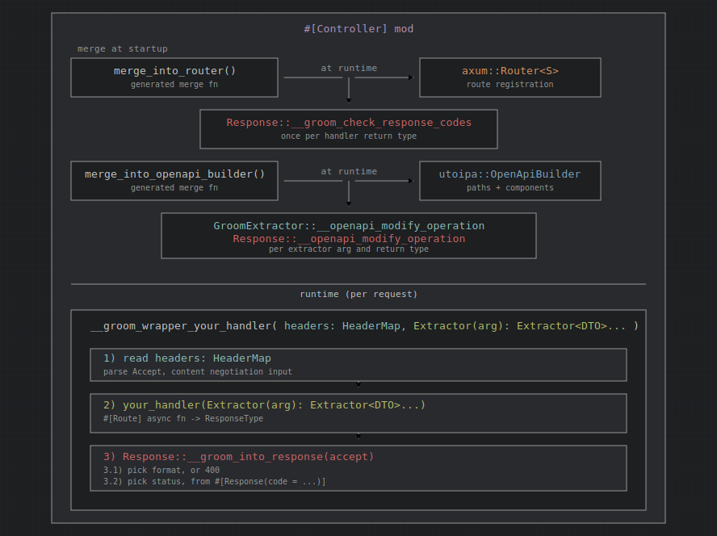

# groom architecture

The `groom` crate is the **runtime library** for [Groom](https://github.com/root-talis/groom): traits, content negotiation, OpenAPI component bookkeeping, and small helper macros. Compile-time code generation (proc-macros, handler wrappers, route registration) lives in the sibling [`groom_macros`](../groom_macros) crate; see [groom_macros/ARCHITECTURE.md](../groom_macros/ARCHITECTURE.md) for that side.

Groom sits between user-defined controller modules and two existing ecosystems:

- **[axum](https://github.com/tokio-rs/axum)** — routing, extractors, `IntoResponse`
- **[utoipa](https://github.com/juhaku/utoipa)** — OpenAPI document construction

Handlers return domain types; generated wrappers call into this crate to turn those types into HTTP responses and to enrich OpenAPI operations.

## Crate layout

```
groom/
├── src/
│   ├── lib.rs                  # Public modules, DTO marker traits
│   ├── content_negotiation.rs  # Accept / Content-Type parsing
│   ├── json_ptr.rs             # JSON Pointer escaping for $ref paths
│   ├── runtime_checks.rs       # HTTP status code collision detection
│   ├── extract/
│   │   ├── mod.rs              # GroomExtractor trait, binary_request_body!
│   │   ├── components_registry.rs
│   │   ├── parameters.rs       # Path<T> / Query<T> OpenAPI wiring (+ axum-extra Query)
│   │   └── std_types.rs        # Built-in axum extractors
│   └── response/
│       ├── mod.rs              # Response trait
│       ├── html_response.rs    # HtmlFormat trait, html_format!
│       └── result.rs           # Result<T, E> as Response
└── Cargo.toml
```

## How the pieces fit together

At a high level, a `#[Controller]` module (from `groom_macros`) generates two merge functions. Both paths share the same type definitions but use different traits from this crate.



**Request path (runtime).** Axum dispatches to a generated wrapper. The wrapper parses the `Accept` header, calls the original handler, then passes the return value to `Response::__groom_into_response`.

**OpenAPI path (build time of the spec).** For each handler, generated code folds `GroomExtractor::__openapi_modify_operation` over every argument type and `Response::__openapi_modify_operation` over the return type, accumulating schemas in a `ComponentsRegistry` before merging into `OpenApiBuilder`.

**Startup check.** The first call to `merge_into_router` runs `Response::__groom_check_response_codes` for each handler return type via `HTTPCodeSet`, panicking if two variants map to the same HTTP status code.

## Core traits (`lib.rs`)

Marker traits indicate how a type is used in the API contract. They are implemented only by `#[DTO(...)]` (generated in `groom_macros`); do not implement them manually.

| Trait | Meaning |
|-------|---------|
| `DTO` | Type is annotated with `#[DTO(...)]`; requires `utoipa::ToSchema` |
| `DTO_Request` | `#[DTO(request)]` — used as request body schema |
| `DTO_Response` | `#[DTO(response)]` — used as response body schema |

`DTO` + `utoipa::IntoParams` is required for path and query parameter structs (`#[DTO(parameters)]`).

## Extraction (`extract/`)

### `GroomExtractor`

```rust
pub trait GroomExtractor {
    fn __openapi_modify_operation(
        op: OperationBuilder,
        components: &mut ComponentsRegistry,
    ) -> OperationBuilder;
}
```

Any handler argument that should appear in the OpenAPI operation must implement this trait (in addition to axum's `FromRequest` where applicable). The macro crate asserts `GroomExtractor` at compile time for every handler parameter.

Implementations in this crate:

| Type | OpenAPI effect |
|------|----------------|
| `Query<T>` where `T: DTO + IntoParams` | Query parameters from `T::into_params` |
| `axum_extra::extract::Query<T>` where `T: DTO + IntoParams` | Same as `Query<T>`; requires feature `axum-extra-query` (repeated keys → `Vec` fields) |
| `Path<T>` where `T: DTO + IntoParams` | Path parameters from `T::into_params` |
| `String` | Request body `text/plain` |
| `Bytes` | Request body `application/octet-stream` (binary) |
| `Request`, `HeaderMap`, `Extension<T>`, `State<T>` | No OpenAPI change (pass-through) |

`#[RequestBody]` types implement `GroomExtractor` in `groom_macros`. Use `groom::binary_request_body!` for custom binary content types over `Bytes`.

### `groom_empty_extractor!`

Exported macro for third-party or custom axum extractors that should not alter the OpenAPI document:

```rust
groom::groom_empty_extractor!(MyCustomExtractor);
```

### `ComponentsRegistry`

When building OpenAPI, nested DTO schemas must be registered under `#/components/schemas/...` with stable `$ref` pointers. `ComponentsRegistry`:

1. Calls `ToSchema::schemas` to collect nested schema names.
2. Registers each named schema once, building a `Ref` with a JSON-Pointer-safe path via `json_ptr::escape_json_pointer`.
3. Skips inline registration for primitive-like schemas (currently `String`).
4. Panics on name collisions between different Rust types that share the same schema name.
5. Merges into an existing `utoipa::openapi::Components` via `into_components`, detecting duplicate definitions across controllers.

`parameters.rs` uses the registry when wiring `Path<T>` and `Query<T>`: parameter schemas are matched to registered components so operations reference `$ref` instead of duplicating inline schemas.

Axum's `Query` cannot deserialize repeated query keys into `Vec` fields. The optional Cargo feature `axum-extra-query` adds a `GroomExtractor` impl for `axum_extra::extract::Query<T>` with identical OpenAPI folding; handlers that need `Vec` or `Option<Vec>` in a `#[DTO(parameters)]` struct should use that extractor and depend on `axum-extra` with the `query` feature.

## Responses (`response/`)

### `Response`

```rust
pub trait Response {
    fn __openapi_modify_operation(op: OperationBuilder, c: &mut ComponentsRegistry) -> OperationBuilder;
    fn __groom_into_response(self, accept: Option<Accept>) -> axum::response::Response;
    fn __groom_check_response_codes(context: &str, codes: &mut HTTPCodeSet);
}
```

Implemented by `#[Response]` enums and structs in `groom_macros`. Responsibilities split as follows:

| Method | When | Role |
|--------|------|------|
| `__openapi_modify_operation` | Spec generation | Adds response entries (status, content types, schemas) |
| `__groom_into_response` | Each request | Content negotiation + serialization |
| `__groom_check_response_codes` | Router merge (once) | Ensures distinct status codes across variants |

### `Result<T, E>`

`response/result.rs` provides a blanket impl when both `T` and `E` implement `Response`:

- OpenAPI merges success and error response definitions.
- `Ok(v)` and `Err(e)` delegate to the respective `__groom_into_response`.
- Status-code checks run on both sides with distinct context strings.

This allows handlers to return `Result<GreetOk, GreetFailure>` instead of a single response enum.

### HTML (`html_response.rs`)

For `format(html)` or multi-format responses, body types must implement `HtmlFormat`:

```rust
pub trait HtmlFormat {
    fn render(self) -> Html<Body>;
}
```

`String` and `&'static str` implement `HtmlFormat` directly. For domain types, use `groom::html_format!` to plug in templating (Askama, Tera, Minijinja, or plain `format!`).

JSON and plain-text serialization are handled in generated code (`groom_macros`); HTML goes through `HtmlFormat::render`.

## Content negotiation (`content_negotiation.rs`)

### Outgoing responses (`Accept`)

`parse_accept_header` reads `HeaderMap` and parses `Accept` into `accept_header::Accept`. Generated `__groom_into_response` implementations compare client preferences against a `const` list of supported MIME types (from `#[Response(format(...))]`).

- If `Accept` is missing or unmatched, `default_format` from the `#[Response]` attribute is used (required when multiple formats are enabled).
- If the client requests an unsupported type, the generated code returns `400` with a plain-text explanation.

### Incoming request bodies (`Content-Type`)

`#[RequestBody(format(json, url_encoded))]` uses:

- `parse_content_type_header` — parse `Content-Type` as `mime::Mime`
- `get_body_content_type` — map to `BodyContentType::Json` or `FormUrlEncoded`

JSON detection follows the same rules as axum's JSON extractor (`application/json` and `+json` suffixes). Unsupported or missing content types produce a typed rejection enum (`BadContentType`, etc.) generated in `groom_macros`.

## JSON Pointer helpers (`json_ptr.rs`)

OpenAPI `$ref` locations use JSON Pointer syntax (RFC 6901). Schema names and path segments containing `/` or `~` are escaped (`/` → `~1`, `~` → `~0`).

`escape_json_pointer` is used by `ComponentsRegistry` when building `#/components/schemas/{name}` refs and by `#[RequestBody]` when referencing DTO schemas. This keeps refs valid for paths like `/users/{id}` in the OpenAPI document.

## Runtime checks (`runtime_checks.rs`)

`HTTPCodeSet` tracks HTTP status codes seen while walking a handler's return type. `ensure_distinct` panics with a context string if a code is reused — for example when two variants of a `#[Response]` enum share the same `code`, or when `Result<Ok, Err>` maps overlapping codes from both sides.

Checks run when `merge_into_router` is first invoked, before routes are registered, so misconfigured APIs fail fast at startup rather than at runtime.

## Public macros

| Macro | Module | Purpose |
|-------|--------|---------|
| `binary_request_body!` | `extract` | Newtype over `Bytes` with a custom request content type in OpenAPI |
| `html_format!` | `response` | Implement `HtmlFormat` for a type |
| `groom_empty_extractor!` | `extract` | No-op `GroomExtractor` for custom extractors |

Proc-macros (`#[Controller]`, `#[Route]`, `#[DTO]`, `#[RequestBody]`, `#[Response]`) are re-exported from `groom_macros`, not this crate.

## Cargo features

| Feature | Enables | Purpose |
|---------|---------|---------|
| `axum-extra-query` | optional `axum-extra` (`query`) | `GroomExtractor` for `axum_extra::extract::Query<T>` — array query parameters |

## Dependencies

| Crate | Role |
|-------|------|
| `axum` | HTTP types, `Html`, body types used in trait signatures |
| `axum-extra` (optional) | `Query` extractor with repeated-key / `Vec` support |
| `utoipa` | OpenAPI builder types, `ToSchema`, `IntoParams` |
| `accept_header` | `Accept` header parsing and preference matching |
| `mime` | MIME constants and `Content-Type` parsing |
| `http` | `HeaderMap`, header names |
| `serde` | (De)serialization is used in generated code; listed for DTO trait bounds via utoipa |
| `derive_more` | Utility derives in generated or internal code paths |
| `async-trait` | Async trait support where needed |

## Relationship to `groom_macros`

| Concern | `groom` (this crate) | `groom_macros` |
|---------|----------------------|----------------|
| Trait definitions | `GroomExtractor`, `Response`, `DTO`, `HtmlFormat` | — |
| Handler / route wiring | — | `#[Controller]`, `#[Route]` wrappers |
| Type derives | Marker trait impls only | `#[DTO]`, `#[RequestBody]`, `#[Response]` |
| Content negotiation logic | Parsing helpers | MIME lists, match arms in generated `__groom_into_response` |
| OpenAPI assembly | `ComponentsRegistry`, parameter folding | Per-type `__openapi_modify_operation` bodies |
| Compile-time assertions | — | `static_assertions` in generated code |

Downstream applications depend on **both** crates: `groom_macros` at compile time and `groom` at runtime (traits and helpers referenced from generated code).

## Testing

- **Unit tests** in `json_ptr.rs` and `components_registry.rs` cover pointer escaping and schema registration edge cases.
- **Integration tests** in the workspace [`groom_tests`](../groom_tests/tests/features/) exercise end-to-end behavior (content negotiation, `Result` responses, multiple controllers, etc.).
- **Macro expansion snapshots** in [`groom_macros/tests/`](../groom_macros/tests/) validate generated glue code.

Run all groom-related tests from the workspace root:

```bash
cargo test -p groom
cargo test -p groom_macros
cargo test -p groom_tests
```

## Design notes

- Groom deliberately does not own the server, global middleware, or base OpenAPI metadata — it merges into existing `Router` and `OpenApiBuilder` values.
- Invalid `Accept` or `Content-Type` currently yields `400` with a plain-text body.
- `GroomExtractor` and `Response` use `__`-prefixed methods to signal they are library hooks, not user API.
