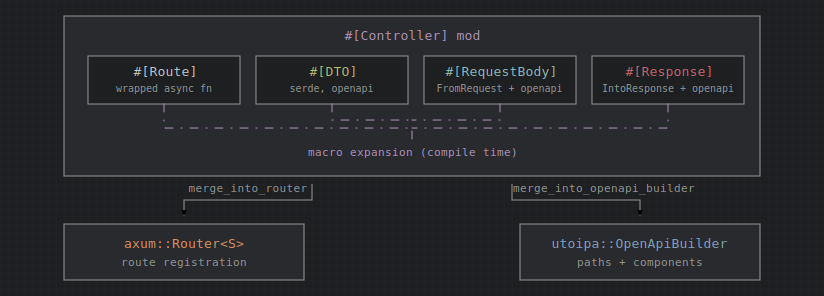

# groom_macros architecture

`groom_macros` is a `proc-macro = true` crate that implements the compile-time half of [groom](https://github.com/root-talis/groom): it parses user annotations, validates handler and type shapes, and emits expanded Rust code that wires into [axum](https://github.com/tokio-rs/axum) routing and [utoipa](https://github.com/juhaku/utoipa) OpenAPI generation. Runtime behavior (content negotiation, trait definitions, runtime checks) lives in the sibling `groom` crate; this crate only generates the glue.

## Crate layout

```
groom_macros/
├── src/
│   ├── lib.rs              # Proc-macro entry points
│   ├── annotation_attrs.rs # Parse/remove helper attributes on items
│   ├── comments.rs         # Doc comment extraction for OpenAPI metadata
│   ├── http.rs             # HTTP method and status code parsing
│   ├── controller.rs       # #[Controller] and #[Route]
│   ├── response.rs         # #[Response]
│   ├── request_body.rs     # #[RequestBody]
│   └── dto.rs              # #[DTO]
└── tests/
    ├── tests.rs            # macrotest expansion snapshots
    └── expand/             # Input fixtures and expected expansions
```

## Shared infrastructure

### Entry points (`lib.rs`)

Four attribute proc-macros are exported:

| Macro | Module | Purpose |
|-------|--------|---------|
| `#[Controller]` | `controller` | Transform a module of handlers into a routable API surface |
| `#[Response]` | `response` | Implement `groom::response::Response` for enums and structs |
| `#[RequestBody]` | `request_body` | Implement `GroomExtractor` + `FromRequest` for request bodies |
| `#[DTO]` | `dto` | Derive serde/utoipa traits and marker impls for data types |

All macros use `proc_macro_error` for span-aware errors and `darling` for attribute parsing. The `extract_macro_arguments!` macro in `lib.rs` is the shared helper for parsing macro attribute token streams into `darling::FromMeta` structs.

### Annotation helpers (`annotation_attrs.rs`)

`parse_attr` and `remove_attrs` find a helper attribute by name (e.g. `Route`, `Response`) on a function or type, parse its arguments with `darling`, and strip it from the AST so it does not reach the compiler as an unknown attribute. Nested annotations like `#[Route(method = "get", path = "/")]` on handler functions are handled this way rather than as separate proc-macros.

### Doc comments (`comments.rs`)

Handler and type doc comments are read from `#[doc = "..."]` attributes and split into OpenAPI **summary** (first paragraph) and **description** (remainder). `get_docblock_parts` is used by `#[Controller]` when building operation metadata; `get_docblock` is used by `#[Response]` and `#[RequestBody]` for response/request descriptions.

### HTTP primitives (`http.rs`)

- `HTTPMethod` — parses `method` in `#[Route(...)]` and selects the matching `axum::routing::*` method when registering routes.
- `HTTPStatusCode` — parses `code` in `#[Response(...)]`; defaults to `200`.

## `#[Controller]`

Annotate a **module** (not a struct or function) to turn it into a self-contained API controller.

### Arguments

```rust
#[Controller]                    // state type defaults to ()
#[Controller(state_type = MyState)]
```

`state_type` becomes the `S` in `axum::Router<S>` for `merge_into_router`.

### Handler discovery

The macro walks every item in the module:

- **Functions without `#[Route]`** — left unchanged (utilities, private helpers).
- **Functions with `#[Route(method = "...", path = "...")]`** — treated as HTTP handlers and transformed.
- **Other items** (types, constants, nested modules) — passed through unchanged.

Each routed handler must be `async` and must not take `self`. Duplicate `(method, path)` pairs are rejected at compile time.

### Per-handler code generation

For each handler, the macro:

1. Strips `#[Route]` and rewrites doc comments (summary/description preserved for OpenAPI; a generated line documents the HTTP method and path).
2. Keeps the **original handler function** as the business-logic entry point.
3. Emits a **wrapper function** `__groom_wrapper_{name}` that:
   - Takes `HeaderMap` plus the same typed arguments as the handler.
   - Parses the `Accept` header via `groom::content_negotiation::parse_accept_header`.
   - Calls the original handler and passes the result to `Response::__groom_into_response`.
4. Asserts at compile time that every handler argument implements `groom::extract::GroomExtractor` and the return type implements `groom::response::Response`.
5. Registers OpenAPI operation modifiers for each extractor and the return type.

### Module-level output

The transformed module gains two merge functions:

- **`merge_into_router(other) -> Router<S>`** — builds a sub-router with all `#[Route]` handlers, runs runtime HTTP status-code collision checks, then merges into `other`.
- **`merge_into_openapi_builder(other) -> OpenApiBuilder`** — accumulates paths and components from all handlers and merges into an existing OpenAPI document.

Runtime checks (`__groom_runtime_checks`) walk each handler return type and call `Response::__groom_check_response_codes` to detect duplicate status codes across variants (important for `Result<T, E>` and multi-variant response enums).

## `#[Response]`

Implements `groom::response::Response` for **enums** (typical multi-status API) or **structs** (single-status typed body).

### Arguments

```rust
#[Response(format(plain_text, html, json), default_format = "json")]
#[Response(code = 418)]  // struct only; enum uses per-variant code
```

- `format(...)` — which representations the type can serialize to (`plain_text`, `html`, `json`).
- `default_format` — required when more than one format is enabled; used when the client sends no `Accept` header.
- `code` — HTTP status (struct default; enum variants use `#[Response(code = ...)]` on each variant).

### Enum responses

Each variant **must** have `#[Response(code = ...)]`. Variants may be:

- **Unit** — status only, no body.
- **Tuple with one unnamed field** — body payload; field type must implement `utoipa::PartialSchema` or `groom::DTO_Response` for OpenAPI. Rust's `Result<>` type naturally falls into this category.

The macro generates:

- `into_response_*` methods per enabled format (plain text, HTML, JSON).
- `__groom_into_response` — negotiates `Accept` against a `const` MIME list, or returns `400` if unsupported.
- `__openapi_modify_operation` — one OpenAPI response entry per variant/status.
- `__groom_check_response_codes` — ensures distinct codes across variants.

`#[derive(utoipa::ToSchema)]` is added to the enum.

### Struct responses

Structs delegate schema work to `#[DTO(response)]` (injected automatically in the generated AST). Named fields, single-field tuple structs, and unit structs are supported with format-specific serialization rules. Unit structs may only specify `code` without `format(...)`.

## `#[RequestBody]`

Implements request-body extraction for a **struct** only.

### Arguments

```rust
#[RequestBody(format(json))]
#[RequestBody(format(json, url_encoded))]
```

At least one format is required.

### Struct shapes

| Shape | Behavior |
|-------|----------|
| Named fields | Deserializes directly into the struct; struct must satisfy `DTO` schema needs via fields |
| Single unnamed field | Wraps an inner `DTO` type; outer struct is the extractor, inner type is deserialized |
| Unit / empty tuple | Compile error |

### Generated code

For each enabled format, the macro emits:

- A `match` arm in `FromRequest::from_request` using axum's `Json` or `Form` extractor.
- OpenAPI `request_body` content schema referencing the DTO.
- A `{Name}Rejection` enum (`BadContentType`, `JsonRejection`, `FormRejection`, …) with `IntoResponse`.

The type also implements `groom::extract::GroomExtractor` to attach the request body to the operation in OpenAPI.

## `#[DTO]`

Marks plain data types used in requests, responses, or path/query parameters.

### Arguments

At least one flag is required:

```rust
#[DTO(request)]      // Deserialize + DTO_Request
#[DTO(response)]     // Serialize + DTO_Response
#[DTO(parameters)]   // utoipa::IntoParams (path/query)
#[DTO(request, response, parameters)]
```

### Generated code

Depending on flags, the macro adds:

- `#[derive(serde::Deserialize)]` — `request` or `parameters`
- `#[derive(serde::Serialize)]` — `response`
- `#[derive(utoipa::ToSchema)]` — always
- `#[derive(utoipa::IntoParams)]` — `parameters`
- Blanket marker impls: `DTO`, and optionally `DTO_Request` / `DTO_Response`

Works on both structs and enums.

Parameter structs with `Vec` or `Option<Vec>` fields are used with `axum_extra::extract::Query` (not axum's `Query`) when the client sends repeated keys; enable the `groom` feature `axum-extra-query` and see the root README.

## How the pieces fit together

A typical controller module combines the macros in layers:



**Compile-time guarantees** use `static_assertions::assert_impl_all!` / `assert_impl_any!` in generated code so missing trait impls surface as clear errors on the handler or type definition.

**Runtime checks** (status code uniqueness) run once when `merge_into_router` is first called, before routes are registered.

## Dependencies

| Crate | Role in generated code |
|-------|------------------------|
| `groom` | Traits (`Response`, `GroomExtractor`, `DTO`, …), content negotiation, runtime checks |
| `axum` | Router, extractors, `IntoResponse` |
| `utoipa` | OpenAPI builder types |
| `serde` | (De)serialization on DTOs and request bodies |
| `mime` | MIME constants for negotiation and OpenAPI content types |
| `accept_header` | `Accept` header parsing (via groom's response path) |
| `static_assertions` | Compile-time trait bounds |
| `darling` | Attribute parsing (macro crate only) |
| `syn` / `quote` / `proc-macro2` | AST parsing and code generation |

The `groom` path dependency in `Cargo.toml` is used for type references in generated `quote!` blocks; it is not linked into downstream binaries as a runtime dependency of the macro crate itself.

## Testing

Integration behavior is covered in the workspace `groom_tests` crate. Within `groom_macros`, **expansion snapshots** validate generated code:

- `tests/expand/*.rs` — annotated input samples.
- `tests/expand/*.expanded.rs` — expected macro output.
- `tests/tests.rs` runs `macrotest::expand` to diff actual vs expected expansion.

Run macro tests with:

```bash
cargo test -p groom_macros
```

When changing code generation, update the `.expanded.rs` fixtures or add new expand tests under `tests/expand/`.

## Design notes and limitations

- Inspired by [poem-openapi](https://github.com/poem-web/poem)'s derive approach; groom targets axum + utoipa instead.
- `#[Route]` is a helper attribute parsed inside `#[Controller]`, not a standalone proc-macro.
- Enum response variants do not support named fields (only unit or single tuple field).
- Invalid or unsupported `Accept` / `Content-Type` currently yield `400` with a plain-text message.
